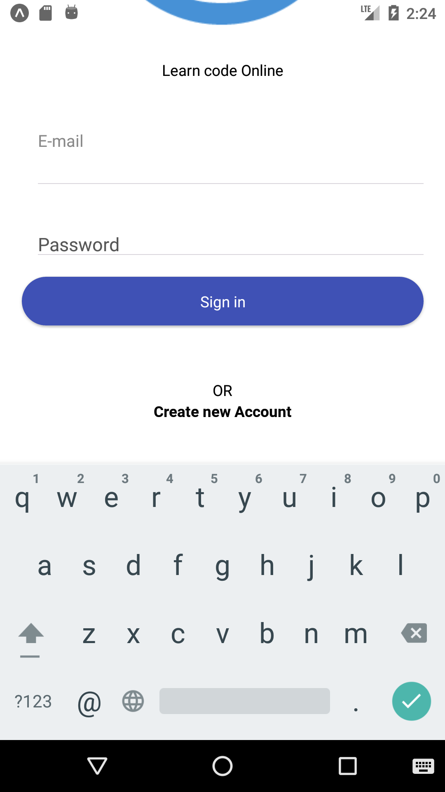

# Authentication using Firebase
This project shows authentication using Email and Password in Firebase.

## Getting Started

1. Prerequesite 
    * React Native
    * Basics of Javascript
    * Firebase Technology

2. Additional Tools
    * VS Code
    * Android Emulator

3. Technologies
    * React Native
    * Native Base
    * Firebase
    * React-Navigation

4. Getting/Downloading Source File
    * You can use GIT Clone or,     
    * Click here,       https://github.com/Dwarikanath1502/Authentication.git

## Releated Images
<<<<<<< HEAD

### This project is tested on Android Emulator as well as on actual android device.

#### **Waiting for Collaborator...**

## NOTE
*This project use email and password authenticaation method using Firebase service by Google*
    
### What we are doing in this Project

**1. SignUp in an Account**

**2. Singing In an Account**

**3. SingOut from Account**

